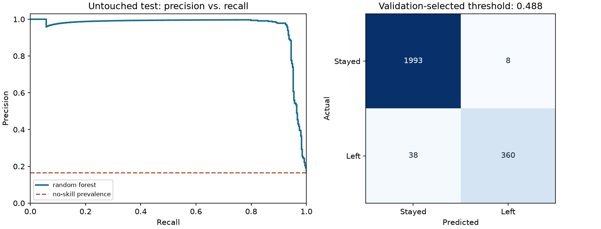

# Predictive Employee Churn — reproducible results

Predict `left=1` (employee departure) from the 14,999-row public HR Analytics benchmark. Exact duplicate records and conflicting duplicate labels are removed before splitting. The model uses the original operational features, with numeric imputation, scaling, and categorical encoding inside a pipeline.

## Evaluation design

Seed 42. Training, validation, and test row counts: 7,194,
2,398, 2,399.
Preprocessing is fitted inside the training pipeline. Model selection uses validation
average_precision; the decision threshold maximizes validation F1.
The selected model is **random_forest**. No tuning uses the test labels.

## Untouched test results

| Measure | Selected model | Constant-prevalence baseline |
|---|---:|---:|
| Average precision | 0.9595 | 0.1659 |
| ROC AUC | 0.9805 | 0.5000 |
| Log loss (lower is better) | 0.0852 | 0.4493 |
| Brier score (lower is better) | 0.0176 | 0.1384 |
| Precision | 0.9783 | 0.0000 |
| Recall | 0.9045 | 0.0000 |
| F1 | 0.9399 | 0.0000 |
| Accuracy | 0.9808 | 0.8341 |

At threshold **0.4884**, the model produces **368** positive flags:
**360** true positives and **8** false positives.
It misses **38** positives; **1,993** negatives are correctly rejected.
Test positive prevalence is **16.59%**, across 2,399 rows.

## Interpretation and limits

The random forest and logistic regression are compared with a constant-prevalence baseline. `feature_importance.csv` measures permutation importance on validation data; it is association, not proof of a cause. `department_summary.csv` is descriptive training-only analysis. This public benchmark has limited source provenance and no employee identifiers or observation dates, so a random holdout cannot prove future-company performance or a specific prediction horizon. It cannot establish that workload causes departures, or that intervening on a feature will retain an employee. Results support an educational analytics demonstration; external and temporal validation would be needed for workplace use.

See [all candidate metrics](metrics.csv), [auditable test predictions](predictions.csv),
[split assignments](splits.csv), and [run metadata, input hash, and package versions](metrics.json).
Numbers here are generated by the script, not copied from the historical notebook.
