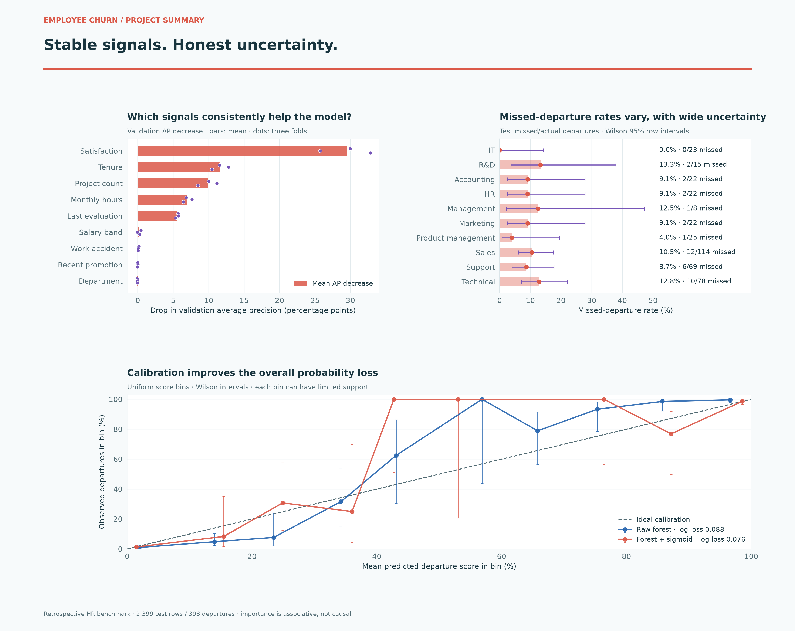
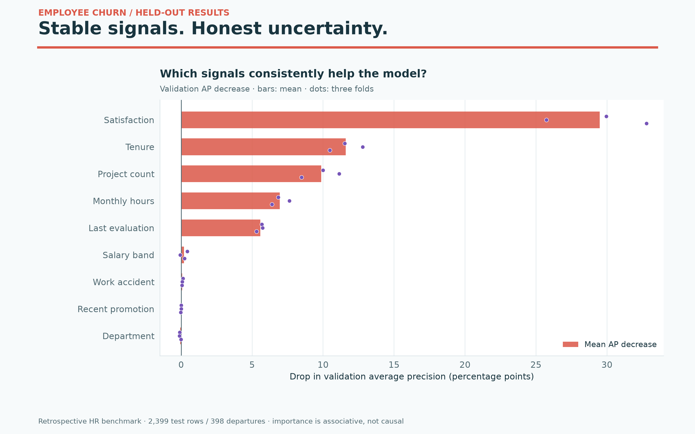
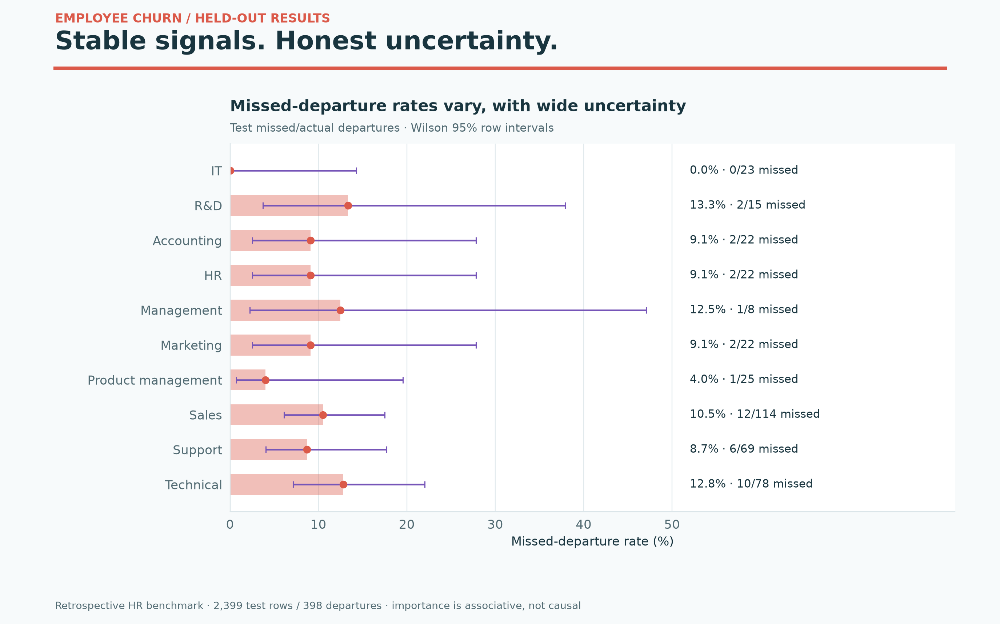
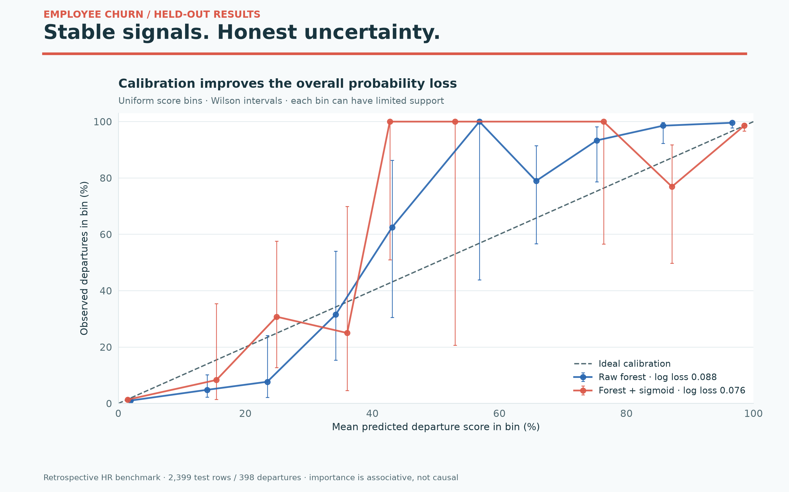

# Employee churn — colorful results gallery

Stable signals. Honest uncertainty.

Retrospective HR benchmark · 2,399 test rows / 398 departures · importance is associative, not causal



High-resolution PNGs and editable SVGs come from saved phase-two results. No model was retrained and no data was downloaded. These are descriptive benchmark results; model and policy choices were fixed on validation.

## Churn Importance

Permutation importance was measured on three development validation folds. Dots are fold estimates, not confidence bounds. A predictive association does not establish a cause of departure.



[PNG](churn_importance.png) · [SVG](churn_importance.svg)

## Churn Departments

Intervals are Wilson 95% intervals assuming independent rows; they do not cover company shift or undocumented feature timing. Small departure counts produce wide intervals. This is not an employee decision tool.



[PNG](churn_departments.png) · [SVG](churn_departments.svg)

## Churn Calibration

Uniform-bin uncertainty is shown, so bins with few rows can look unstable. Overall log loss summarizes all rows. The data lacks a prospective prediction horizon.



[PNG](churn_calibration.png) · [SVG](churn_calibration.svg)

## Reproduce

```bash
python plot_gallery.py
```

Use the pinned project requirements. Sources and hashes are in [chart-provenance.json](chart-provenance.json). Original phase-two outputs are unchanged.
