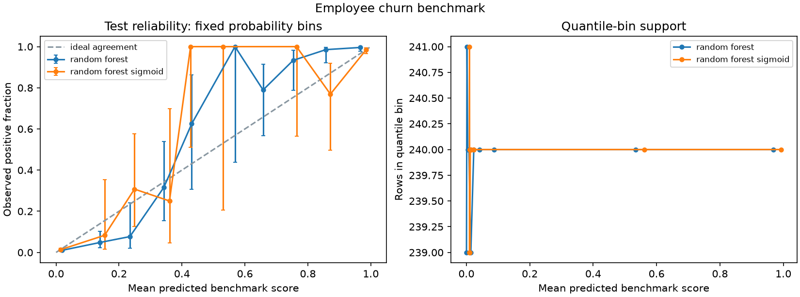
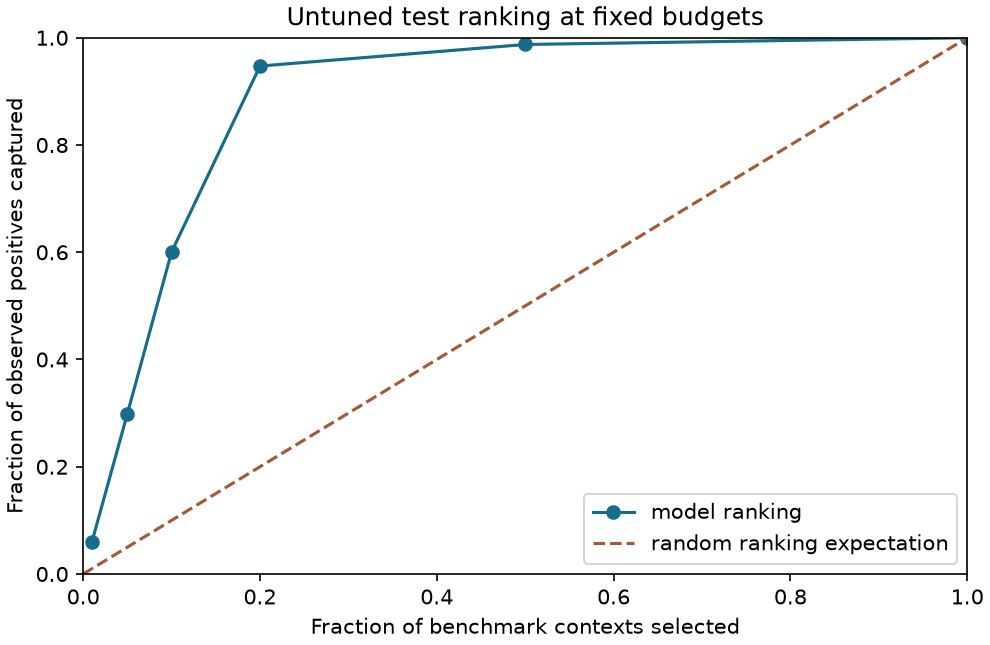

# Phase two: evidence and decision trade-offs

11,991 deduplicated observations. **random_forest_sigmoid** was selected using validation log loss.
fit 45%, independent sigmoid calibration 15%, validation 20%, test 20%; grouped or chronological where available. Calibration uses disjoint reserve labels; preprocessing fits only on fit rows.

| Test measure | Selected | Prior baseline |
|---|---:|---:|
| Average precision | 0.9593 | 0.1659 |
| Log loss | 0.0763 | 0.4493 |
| Brier score | 0.0165 | 0.1384 |
| Precision | 97.8% | 0.0% |
| Recall | 90.5% | 0.0% |

At the validation-selected threshold, 360 positives are found, 38 are missed, and 8 false flags occur.
95% Wilson recall interval: 87.2%–93.0%; precision: 95.8%–98.9%.
The intervals describe this benchmark sample under the stated sampling assumptions.

[Operating policies](operating_policies.csv) choose thresholds exclusively from validation scores for fixed workload budgets.
Ties stay together and can leave a budget partly unused. Applying the same thresholds to test can exceed the validation budget;
the table records actual counts. No dollar-saving or intervention-effect claim is inferred from these retrospective labels.

[Uncertainty](uncertainty.json) contains 200 bootstrap replicates, with clusters resampled when user/context groups exist.
[Validation stability](validation_stability.csv) tests a fixed model structure on three development-only splits.
[Subgroup errors](subgroup_errors.csv) gives support and missed/false-flag counts; small groups warrant caution.
[Error rows](errors.csv), [all candidate metrics](metrics.csv), [test predictions](predictions.csv), and [partition membership](splits.csv) are auditable.

The final test labels are not used to choose calibration, models, budgets, or thresholds. Previously published benchmark results
were known during redevelopment; an independent external evaluation remains necessary. Calibration assumes the same target population.
For CTR, calibration cannot undo unknown upstream negative sampling. For HR, observation dates and a departure horizon are missing;
feature-importance consistency is association, not causality. The fraud benchmark spans two days and anonymized PCA features.
